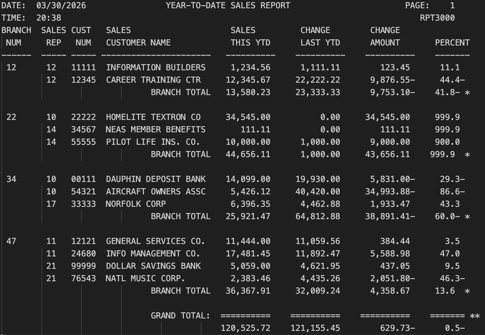

# COBOL RPT3000
___

## Overview
___
The **RPT3000** program is an enhanced COBOL reporting tool. It serves as a data processing utility that reads customer financial records from a master input file (`CUSTMAST`) and generates a formatted, multi-columnar Year-To-Date (YTD) Sales Report.

Building upon the foundations of its predecessor (RPT2000), this version introduces automated branch break processing, detailed customer-level calculations, and improved report pagination. The program detects when the branch number changes, prints branch totals automatically, and continues processing records while maintaining accurate running totals. It also enhances the reporting structure by organizing customer records, totals, and separators in a clear, professional multi-page report format.

## Table of Contents
___
* [New Concepts](#new-concepts)
* [Tech Stack](#tech-stack)
* [Installation](#installation)
* [Running Output](#running-output)
* [Learning Outcomes](#learning-outcomes)
* [Help](#help)
* [Authors](#authors)

### New Concepts
* **Data Transformation:** Processes raw record data, including branch numbers, sales representative IDs, and customer names.
* **Comparative Analytics:** Calculates the **Change Amount** (Current YTD - Last YTD) and the **Change Percent** for every customer.
* **Grand Totals:** Aggregates all individual customer metrics to provide a final summary of total company performance.
* **Automated Formatting:** Features a dynamic page-breaking system, standardized headers with real-time date/time stamps, and clean visual separators using COBOL `ALL` clauses.

## Tech Stack
___
* 
* 
* 

## Installation
___
1. Clone the repository to your local machine. (or just steal my code)
2. Put the code into VS Code in your mainframe of choice

## Running Output
___

## Learning Outcomes
___
This project helped reinforce several important COBOL and data processing concepts:
*	Understanding COBOL file processing using sequential input and output files.
*	Implementing control break logic to detect changes in branch numbers.
*	Performing financial calculations such as sales differences and percentage changes.
*	Designing formatted reports with headings, spacing, and structured output.
*	Managing running totals and grand totals across multiple records.
*	Using working storage variables effectively to track state, totals, and calculations.
*	Improving program organization through structured procedures and modular design.
*	One-Level Summary Report: Implemented a structured reporting approach that summarizes data at a single control level (branch), including automatic calculation and display of branch totals before moving to the next group.
 * First-Record Switch: Utilized a control flag to properly handle the first record in the dataset, preventing premature control-break logic execution and ensuring accurate initialization of totals.

## Help
___
* Make sure compiler is running correctly.
* Potentially re-clone repository
* restart IDE

## Authors
___

**Clay Rasmussen**
* **Clay's GitHub Profile**: [Clay-Rasmussen](https://github.com/Clay-Rasmussen)
* **Clay's Email**: [Clrasm02@wsc.edu](mailto:clrasm02@wsc.edu)
___

**Kirby Dunker**
* **Kirby's GitHub Profile**: [KirbyD-YEAH](https://github.com/KirbyD-YEAH)
* **Kirby's Email**: [brdunk02@wsc.edu](mailto:brdunk02@wsc.edu)

[Back to the top](#overview)
